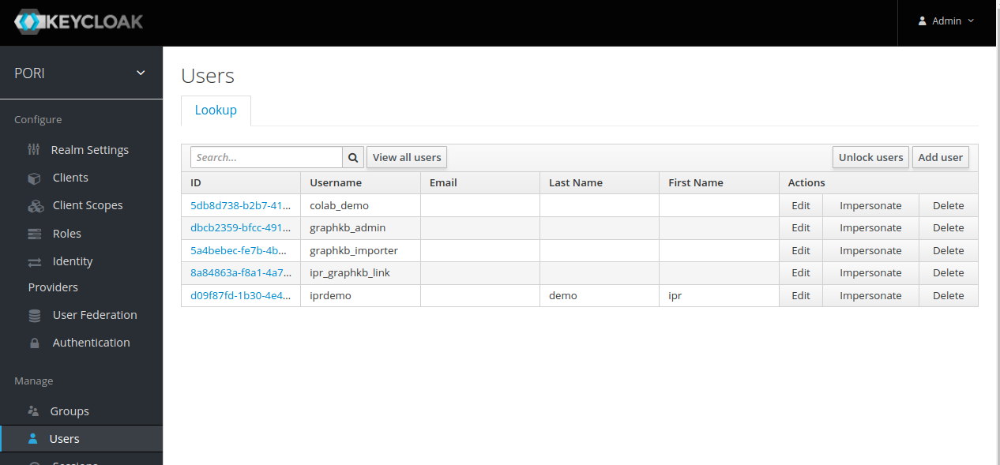

# Getting Started

For working on most of the PORI-related projects you will need to have a number of the components set up. For example, to work on the GraphKB API you will need both an OrientDB server and a Keycloak server already running.

If your institution regularly works on PORI related projects then we reccommend setting up a development instance of the PORI platform which your developers can point their applications to. If you do not have access to something like this, then the easiest way to get the dependencies for whatever part of the PORI platform you are working on up and running is by running the development version of the docker compose configuration found in this repository: [docker-compose.dev.yml](https://github.com/bcgsc/pori/blob/master/docker-compose.dev.yml).

```yaml title="docker-compose.dev.yml"
--8<-- "./docker-compose.dev.yml"
```

## The Auth Container

The demo uses a default keycloak setup with a realm "PORI" and two clients: "GraphKB" and "IPR".
For convenience there are also a number of default users which all have the default password of "secret".



## Run docker-compose

First thing you should do is create new/empty directories for the data stored by GraphKB and IPR.

```bash
mkdir -p databases/{postgres,orientdb}/{backup,data}
```

You should also create a new directory for storing the public key from keycloak. This key will be downloaded and store so that it was be used in checking incoming tokens by the GraphKB and IPR APIs. If this directory already exists you should delete and remake it.

```bash
mkdir keys
```

Now you are ready to start up with the dev compose yml

```bash
docker-compose -f demo/docker-compose.dev.yml up -d
```

It will take a minute or two for all of the servers to start. You can check how they look with docker

```bash
docker ps
```

If any of them show "(health: starting)" then they are not ready yet.


### Viewing Log Files

Sometimes you will need to check the logs from the various servers, this can be done with the docker logs command. First find the container ID (or name) by listing all the running containers with `docker ps` and then run the following

```bash
docker logs <CONTAINER ID>
```

### Loading Data into GraphKB

If you are running the GraphKB loader via its docker container you will need to tell it to use the host network so that it is able to find the GraphKB API.

Here is an example of running the GraphKB Loader on the vocabulary terms using the docker container and the docker-compose setup described above.

First download the vocabulary terms data

```bash
wget https://raw.githubusercontent.com/bcgsc/pori_graphkb_loader/develop/data/vocab.json
```

Then you can load these terms using the ontology file loader

```bash
docker run --net host bcgsc/pori-graphkb-loader:latest \
    -u graphkb_importer \
    -p secret \
    -g http://localhost:8888/api \
    file \
    ontology \
    vocab.json
```
