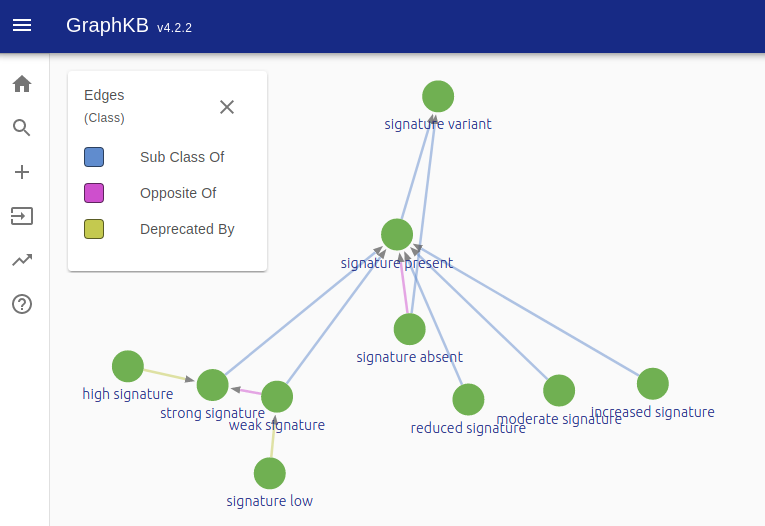

# About GraphKB

GraphKB is a graph-based implementation of a cancer knowledge base. An overview of some of the features of GraphKB are given below.

## Features

### Dual Aggregate and Standalone KB

GraphKB functions both as an aggregate knowledge base as well as a standalone application. Data can be imported from many external sources (see the [data loading page](./loading_data.md)), but it can also be input directly. This also allows users to make manual updates and changes to imported content which is helpful when there may be errors or missing data that needs to be addressed in a time-sensitive manner.

### Multiple Overlapping Ontologies

GraphKB is unique among other knowledge base projects in its inclusion of ontology relations and subsquent real-time leveraging of their inherent graph structure. The simultaenous loading of multiple overlapping ontologies allows for better coverage of terms when loading data from resources without controlled vocabulary[^1]. It also enables users to match the chosen ontology of the source resource when it has one.

[^1]: [Reisle, C. et al. A Platform for Oncogenomic Reporting and Interpretation. bioRxiv 2021.04.13.439667 (2021) doi:10.1101/2021.04.13.439667](https://www.biorxiv.org/content/10.1101/2021.04.13.439667v1)

### Non-specific Variant Notation Allows Curating Novel Variants

The goal of GraphKB is to allow users to input content and match the specificity that was given by the source that they are curating. For example if a source claims that any truncating mutation in a particular gene is damaging then we would like to put that in as any truncating mutation rather than create a list of known or previously seen truncating mutations. The motivation here is that then if a novel mutation appears which fits this categorization we will be able to match and annotate it as well. GraphKB accomplishes this both by [extending HGVS](../variant_notation/index.md) to allow other coordinate systems (such as exons) but also through allowing categorical variants as seen in the next section.

### Support for Complex Variant Types

Variants in GraphKB can be defined by a position (PositionalVariant) or a category (CategoricalVariant). While GraphKB supports the traditional variant types (ex. single nucleotide variants), it also supports any number of more complex variant types (ex. molecular signatures). These can be defined via the categorical variant types which require only a reference element and a variant type. The reference element would point to a gene in a traditional mutation but can also point to any ontology defined in the database which includes molecular signatures and biological pathways. The type is defined by the Vocabulary packaged with GraphKB as a [JSON input](https://github.com/bcgsc/pori_graphkb_loader/blob/develop/data/vocab.json) and can be edited and added to through the user interface.

GraphKB was designed with storing fusions and structural variants in mind. Each variant record includes two reference fields, the latter of which is most often null for other variant types. This allows us to specify the second gene with the same level of specificity as the first.

Some examples of the various categorical variants that it is possible to create in GraphKB may be

| Reference1                          | Reference1 | Type                      | Description                                     |
| ----------------------------------- | ---------- | ------------------------- | ----------------------------------------------- |
| Homologous Recombination Deficiency | null       | strong signature          | A strong HRD signature                          | null |
| KRAS                                | null       | gain of function mutation | Any gain of function mutation in the gene, KRAS |
| EWSR1                               | FLI1       | fusion                    | Any fusion between EWSR1 and FLI1               |

The vocabulary used to create signature variants has been organized to allow multiple levels of specificity.

Similarly, common names of signatures have been organized and related to allow users to input the terminology used by the source they are curating. We include a [molecular signatures ontology file](https://github.com/bcgsc/pori_graphkb_loader/blob/develop/data/signatures.json) in the GraphKB loaders repository for convenience. We welcome contributions and suggestions via that repository.

## Getting Started

### Users

The simplest way to try out GraphKB is via the demo we provide [here](https://pori-demo.bcgsc.ca/).
simply click on the `/graphkb` link and enter the provided credentials (`graphkb_admin`/`graphkb_admin`).
This will allow you to test out the application before having to set up your own instance. If your
institution would like to host an instance of GraphKB please see the instuctions for developers and
system administrators in the next section.

### Developers / Sys-Admins

GraphKB can be installed/setup by itself or in combination with the PORI reporting application, IPR.
To see instructions for setup of the complete platform please see the [main install page](../install.md).

#### Loading Data

When you setup/install GraphKB you will create a new and empty database. Most users will then
want to load some standard content into their newly created instance. We have created scripts and
modules to simplify this process. See the [data loading page](./loading_data.md) for more information.

## Using the Python Adapter

The python adapter to GraphKB is provided for users who would like to incorporate an instance of
GraphKB into their own scripts and pipelines. Additionally it is used by the IPR python adapter to
connect to GraphKB.
