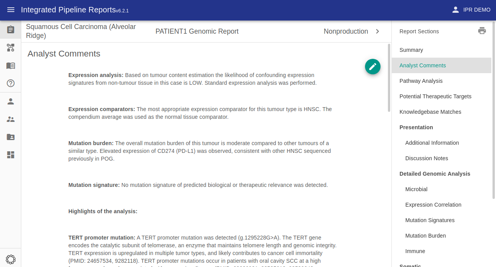
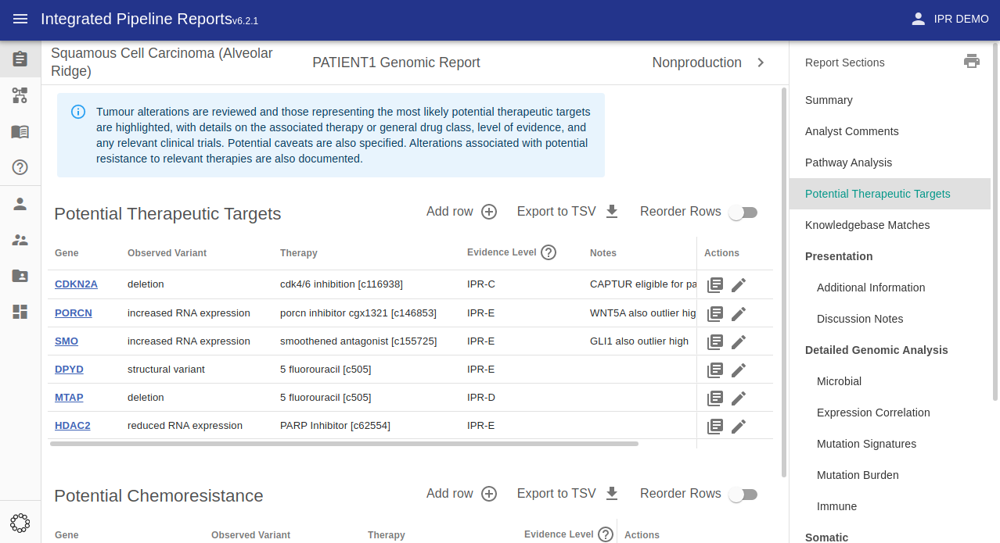
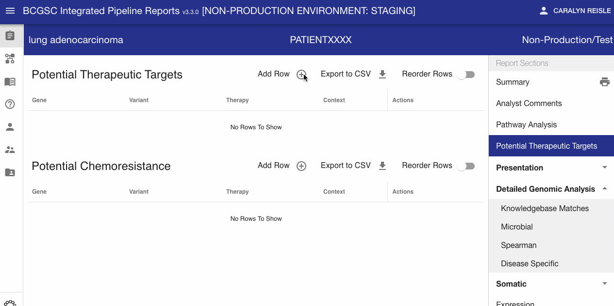
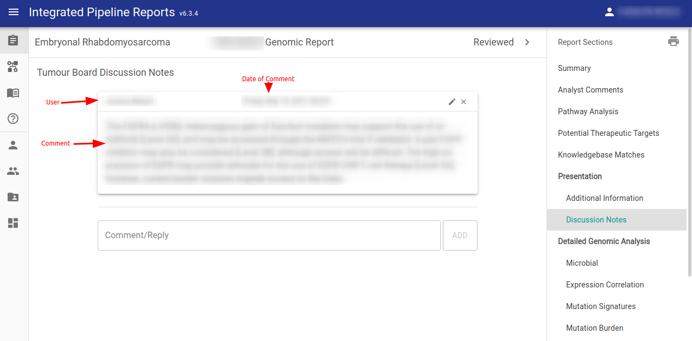
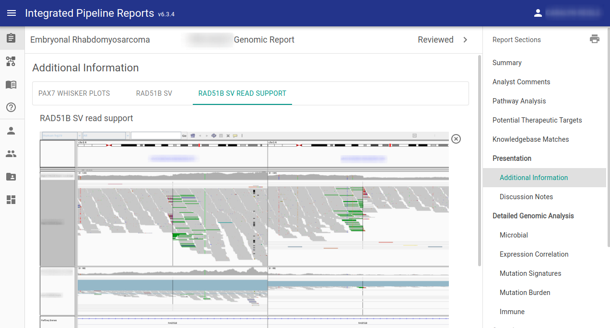

# Manual Curation

IPR supports manually curating/editing many of the sections in the report.

## Analyst Comments

This a free-text section of the report where the case analyst may summarize the findings of the report.

!!! Info "Optionally Semi-Automated"

    Comments can optionally be auto-populated by the report loader

## Therapeutic Options

In this section tumour alterations are reviewed and those representing the most likely potential therapeutic targets are highlighted, with details on the associated therapy or general drug class, level of evidence, and any relevant clinical trials. Potential caveats are also specified. Alterations associated with potential resistance to relevant therapies are also documented.

!!! Info "Optionally Semi-Automated"

    Therapeutic options can optionally be auto-populated by the report loader

Clicking "Add row" button will bring the user to a form which auto-completes from the GraphKB API.

## Discussion

There is a section of the report for recording comments made on the report when it is presented/discussed at the molecular tumour board. This may record the decisions made by the board or anything else of interest that was brought up at the meeting.

## Additional Content

Sometimes the case analyst may have additional images they would like to include on a one-off basis. If these do not correspond to a built-in section of the report they can be included here. The example below is showing read-support in IGV for a structural variant of interest

