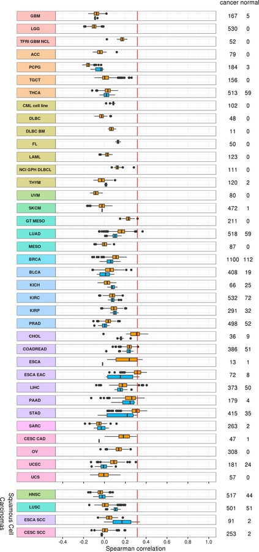

# Expression Correlation

## Comparator-Based Plot

keys: `expression.chart`, `expression.legend`

!!! Info

    These will be passed to the report upload function via the [images section](../images) of the JSON input

This plot represents the pairwise correlation of the RNA expression of the current sample against samples from a variety of reference distributions. Often this is used as a *sanity check* of the diagnosis. It is expected that the sample should correlate most highly with other samples within the disease distribution that is most closely related to the diagnosis. It is also expected that samples with a lower tumour content/purity may show correlation with their biopsy site.



## Subtyping Plots

These plots are similar to the main comparator based plots but are generally smaller and include only a set of subtypes of a specific cancer type (ex. BRCA).

key: `subtypePlot\.\S+`

## Pairwise RNA Expression Correlation

Provide a list of the most similar other samples with respect to the RNA expression profile.

```json
{
     "pairwiseExpressionCorrelation": [
        {
            "patientId": "UPLOADPAT02",
            "library": "LIB0002",
            "correlation": 0.99,
            "tumourType": "pancreatic cancer",
            "tissueType": "liver",
            "tumourContent": 15
        }
    ]
}
```

All values expect the correlation are attributes of the sample being compared to and not the
sample the report is being generated for


