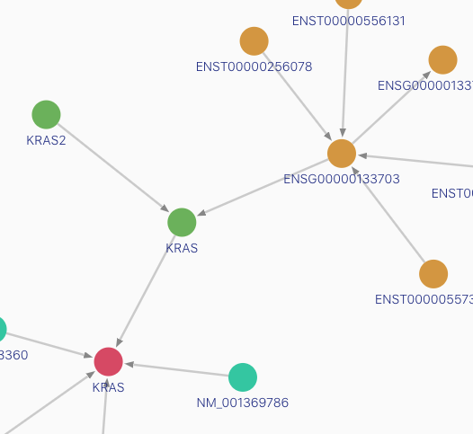

# All PORI Repositories

The platform has two main components: a graph knowledge base ([GraphKB](../graphkb)), and a reporting
application ([IPR](../ipr)). However these are modularized across several repositories listed below.

- ## [GraphKB API](https://github.com/bcgsc/pori_graphkb_api)

    

    GraphKB REST API and Graph Database. The GraphKB database is implemented using [OrientDB](https://orientdb.org/).
    It is a graph database which is used to store variants, ontologies, and the relevance
    of this terms and variants. The KB uses strict controlled vocabulary to provide a parseable
    and machine-readable interface for other applications to build on. The API is a REST API built
    on node/express.

- ## [GraphKB client](https://github.com/bcgsc/pori_graphkb_client)

    

    The GraphKB client is the front-end web client for the GraphKB project. It is built using
    React.js and webpack. The client is used to explore and manage content within GraphKB.

- ## [GraphKB Python Adaptor](https://github.com/bcgsc/pori_graphkb_python)

    

    Python adapter package for querying the GraphKB API. See the related
    [user manual](../graphkb/python/docs) for instructions on incorporating
    this into custom scripts.

- ## [IPR API](https://github.com/bcgsc/pori_ipr_api)

    

    The Integrated Pipeline Reports (IPR) REST API manages data access to the IPR database. The API is
    responsible for storing and server all data for reports.

- ## [IPR client](https://github.com/bcgsc/pori_ipr_client)

    

    The IPR client is front-end web application which consumes data from the IPR API.
    The primary function is the production and management of genomic reports.

- ## [IPR Python Adaptor](https://github.com/bcgsc/pori_ipr_python)

    

    Python adapter for generating reports uploaded to the IPR API. This python tool
    takes in variant inputs as tab-delimited files and annotates them using GraphKB. The resulting
    output is uploaded to IPR as a report. Additional report content such as images and metadata
    can be passed to be included in the report upload. See the related
    [user manual](../ipr/python/docs) for additional information.

- ## [GraphKB Data Loaders](https://github.com/bcgsc/pori_graphkb_loader)

    

    GraphKB loaders is responsible for all data import into GraphKB. Automatic Import modules are
    provided for a variety of external ontologies and knowledgebases such as: Ensembl, Entrez Genes,
    RefSeq, HGNC, Disease Ontology, NCI Thesaurus, CIViC, DoCM, etc.

- ## [GraphKB Parser](https://github.com/bcgsc/pori_graphkb_parser)

    

    A package for parsing and recreating HGVS-like variant notation used in GraphKB. This is used
    by both the API and Client applications. Try it out online with [RunKit](https://runkit.com/creisle/6083062ff39ff0001b93ea6f)

- ## [GraphKB Schema](https://github.com/bcgsc/pori_graphkb_schema)

    

    The GraphKB Schema package defines the vertex and edge classes in the DB. It is used as a
    dependency of both the API and client applications.

