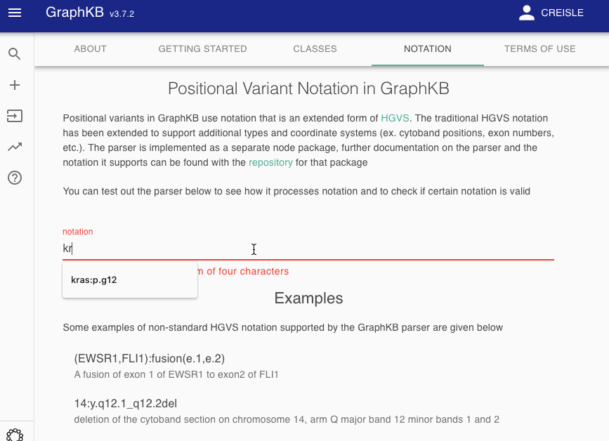

# About Variant Notation

The variant notation is a shorthand to make it faster to enter/display variants. It is made up of two forms: [continuous](./continuous.md), and [multi-feature](./split.md). Most people will be more familiar with the continuous notation. It is based on [HGVS v15.11](http://varnomen.hgvs.org/) and can be used to describe any variant that has only a single reference feature (i.e. KRAS). [Multi-feature notation](./split.md) is required when one needs to describe any variant involving multiple reference features. This could be something like a gene fusion where the reference features might be EWSR1, and FLI1.

!!! Warning

    The notation examples included in this documentation do not necessarily represent actual mutations. While they are all valid syntax, no attempt has been made to check that the sequences given are correct

To make this more transparent to end users, we have provided a notation parser view as part of the GraphKB Client where any input notation may be tested to see how it would be decomposed by the GraphKB parser

## General Notation

### Prefixes

Both forms of notation can be described as two breakpoints and an event type. Some may also include reference sequence and untemplated sequence descriptions. Additionally both forms will use a common prefix notation. These prefixes are described under [coordinate systems](./coordinate_systems/index.md)

### Variant Types

The expected variant types are given below. Some types are only applicable to certain coordinate systems (i.e. frameshifts are protein only).

| Variant Type | Description            |                                   Standard HGVS                                   | Prefix Specific |
| ------------ | ---------------------- | :-------------------------------------------------------------------------------: | :-------------: |
| >            | substitutions          |  [&#10004;](https://varnomen.hgvs.org/recommendations/DNA/variant/substitution/)  |  g / c / r / n  |
| del          | deletions              |    [&#10004;](https://varnomen.hgvs.org/recommendations/DNA/variant/deletion/)    |                 |
| delins       | indels                 |     [&#10004;](https://varnomen.hgvs.org/recommendations/DNA/variant/delins/)     |                 |
| dup          | duplications           |  [&#10004;](https://varnomen.hgvs.org/recommendations/DNA/variant/duplication/)   |                 |
| fs           | frameshifts            | [&#10004;](https://varnomen.hgvs.org/recommendations/protein/variant/frameshift/) |        p        |
| ext          | extensions             | [&#10004;](https://varnomen.hgvs.org/recommendations/protein/variant/extension/)  |        p        |
| ins          | insertions             |   [&#10004;](https://varnomen.hgvs.org/recommendations/DNA/variant/insertion/)    |                 |
| inv          | inversions             |   [&#10004;](https://varnomen.hgvs.org/recommendations/DNA/variant/inversion/)    |                 |
| fusion       | gene fusion            |                                                                                   |                 |
| trans        | translocation          |                                                                                   |                 |
| itrans       | inverted translocation |                                                                                   |                 |
| mut          | non-specific mutation  |                                                                                   |                 |
| spl          | splice site mutation   |                                                                                   |        p        |
| mis          | missense mutation      |                                                                                   |        p        |

### Unsupported HGVS Features

There are a few elements of the [HGVS v15.11](http://varnomen.hgvs.org/) notation that are not yet supported ([contributions are welcome!](https://github.com/bcgsc/pori_graphkb_parser)). These include:

- [mosacism](http://varnomen.hgvs.org/recommendations/DNA/variant/complex/)
- [chimerism](http://varnomen.hgvs.org/recommendations/DNA/variant/complex/)
- [RNA variants](http://varnomen.hgvs.org/recommendations/RNA/)
- [conversions](http://varnomen.hgvs.org/recommendations/DNA/variant/conversion/)
- [alleles](http://varnomen.hgvs.org/recommendations/DNA/variant/alleles/)
- [v20 Complex Variants](https://varnomen.hgvs.org/recommendations/DNA/variant/complex/)
